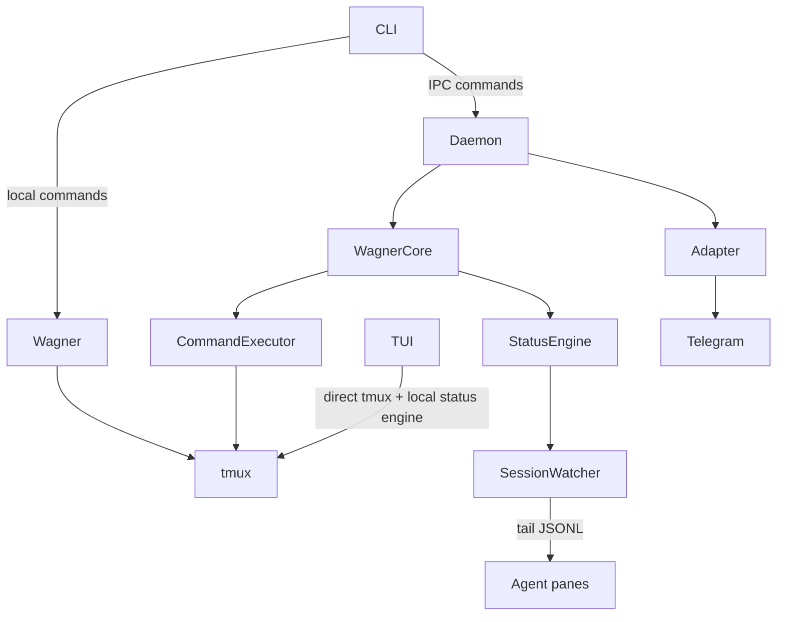

# Wagner Architecture

This document explains how Wagner works internally.
It is intentionally architecture-focused (not a full command reference).

## What Wagner Is

Wagner orchestrates multi-repo agent workflows around four core pieces:

1. tmux panes as execution targets
2. task metadata persisted on disk
3. JSONL-based status derivation from agent output
4. optional remote control/notifications through adapters (Telegram today)

## Runtime Topology

## Main Components

### 1) Orchestration (`Wagner<T, A>`)

`src/wagner.rs` owns task lifecycle for local flows:

- create/start/detach/delete tasks
- create sessions/panes
- launch or resume agents in panes
- maintain tracked pane metadata

This is generic over terminal and default agent implementation.

### 2) Daemon Core (`WagnerCore`)

`src/core/mod.rs` wraps:

- `StatusEngine` for transitions/events
- command execution via `core/command_executor.rs`
- plugin provider registry

Daemon and adapters operate through `CoreCommand`, `CoreResponse`, and `CoreEvent` in `src/transport/mod.rs`.

### 3) Terminal Abstraction (`Terminal`)

`src/terminal/mod.rs` defines the tmux contract.

Important helpers:

- `send_confirm(pane, "y"|"n")`
- `send_text_enter(pane, text, delay_ms)`

`src/terminal/tmux.rs` is the real implementation.

### 4) Monitoring Pipeline

`StatusEngine` (`src/core/status_engine.rs`) + `SessionWatcher` (`src/monitor/watcher.rs`) perform:

1. track known panes from task metadata
2. tail JSONL files per pane
3. parse Claude/Codex events
4. derive pane status (active/idle/waiting)
5. emit debounced session/pane events

Both daemon and TUI embed their own status engine instances.

### 5) Adapter Layer

`src/transport/adapter.rs` defines adapter behavior.

Current daemon adapter selection:

- Telegram adapter when configured
- log adapter fallback otherwise

Telegram implementation is in `src/transport/telegram/`.

## Data Model

`src/model/task.rs`:

- `Task` -> name, path, repos, panes, kind (managed/attached)
- `TaskRepo` -> source/worktree/branch
- `TrackedPane` -> pane id, engine, session id, JSONL path, name
- `Engine` -> `ClaudeCode | Codex | Terminal`

Engine-specific behavior includes:

- launch/resume command
- process-name probe for liveness checks
- enter delay (`enter_delay_ms`) used for reliable submit behavior

## Control Paths

### Local path (CLI/TUI without daemon)

- Task lifecycle commands run through `Wagner<T, A>`.
- TUI reads tmux directly and updates view state from its own status engine.

### Remote/IPC path (CLI -> daemon)

- CLI sends length-prefixed JSON over Unix socket (`transport/ipc.rs`).
- Daemon executes commands via `WagnerCore` + terminal/store.
- Response returns as `CoreResponse`.

### Event path (agents -> adapter)

1. Agent writes JSONL
2. Status engine emits `CoreEvent`
3. Adapter renders and sends notifications
4. Adapter polls user inputs and maps them back to `CoreCommand`

## Daemon Behavior

`src/transport/daemon.rs`:

- runs polling loop on configured interval
- processes status events
- runs adapter event handling and adapter input polling with timeouts
- serves IPC requests
- performs periodic dead-agent health checks and emits `AgentResumed`

Health check currently inspects tmux pane command vs expected engine process name.

## Telegram Adapter Notes

`src/transport/telegram/mod.rs` + `state.rs`:

- command parsing and callback routing
- pane/task id registries for short callback payloads
- reply-to-message routing for fast approvals/input
- focus and pane output modes
- periodic persisted state (`telegram_state.json`) for key routing metadata

This layer is transport-specific; core command/event types remain transport-agnostic.

## Persistence Layout

- Config: `~/.config/wagner/config.json`
- Daemon socket/pid: `~/.config/wagner/daemon.sock`, `daemon.pid`
- Telegram adapter state: `~/.config/wagner/telegram_state.json`
- Task metadata: `<task>/.wagner/task.json`
- Attached task registry: `<tasks_root>/.attached_registry.json`

## Architectural Invariants

1. `CoreCommand/CoreResponse/CoreEvent` are the stable internal transport contract.
2. Status is derived from JSONL + watcher state, not from UI state.
3. tmux is the execution boundary; all sends/captures route through `Terminal`.
4. Adapters should transform core events/commands, not re-implement business logic.
5. Task metadata is source of truth for tracked panes and resume context.

## Current Tradeoffs

1. Daemon currently uses one active adapter implementation at a time.
2. TUI and daemon use separate in-process status engines (simple, but duplicated polling work).
3. Dead-agent detection is heuristic (`pane_current_command` based), not process-tree based.

## Where To Read Next

If you need to modify behavior quickly:

1. Command semantics: `src/core/command_executor.rs`
2. Status transitions/events: `src/core/status_engine.rs`, `src/monitor/*`
3. Daemon loop and lifecycle: `src/transport/daemon.rs`
4. Telegram UX/commands: `src/transport/telegram/{commands,mod,render,state}.rs`
5. Task orchestration: `src/wagner.rs`
